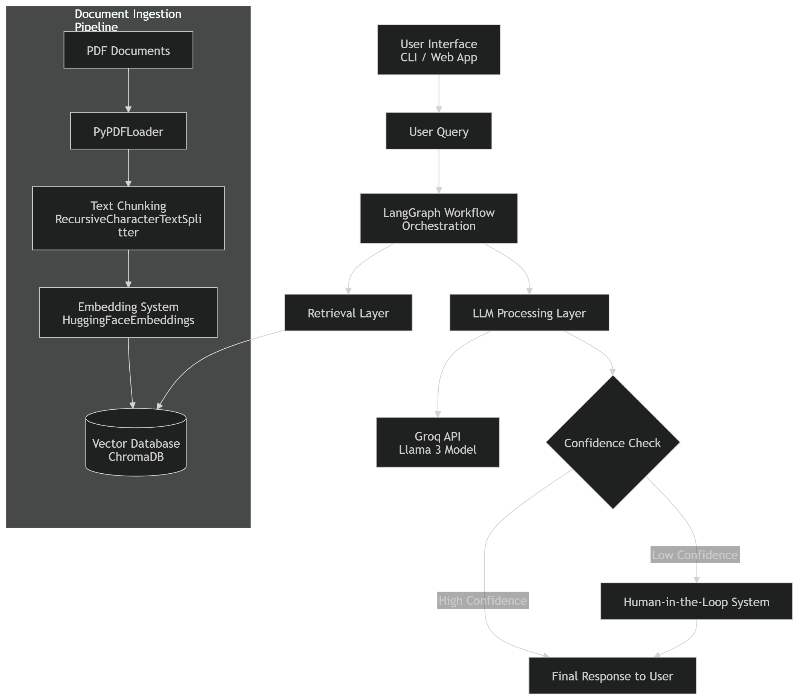

# High-Level Design (HLD): RAG-Based Customer Support Assistant

## 1. System Overview
### Problem Definition
Customer support teams often handle repetitive queries that could be answered using existing documentation. However, static FAQs are often insufficient, and searching through large PDF manuals is time-consuming for both customers and support agents.

### Scope
The system is a Retrieval-Augmented Generation (RAG) assistant designed to:
- Ingest and index a PDF knowledge base.
- Retrieve relevant context based on user queries.
- Generate accurate, context-aware responses using a Large Language Model (LLM).
- Manage complex control logic (retrieval, generation, and escalation) using a stateful graph workflow.
- Escalate low-confidence queries to a human support channel.

---

## 2. Architecture Diagram

---

## 3. Component Description

| Component | Technology | Description |
| :--- | :--- | :--- |
| **User Interface** | CLI / Web App | The entry point where users interact with the assistant. |
| **PDF Documents** | Data Source | The raw knowledge base files used for the RAG system. |
| **PyPDFLoader** | Document Loader | Extracts text and metadata from PDF files. |
| **Text Chunking** | `RecursiveCharacterTextSplitter` | Breaks documents into 1000-character chunks with overlap. |
| **Embedding System** | `HuggingFaceEmbeddings` | Converts text chunks into numerical vectors (embeddings). |
| **Vector Database** | `ChromaDB` | Stores and indexes embeddings for semantic search. |
| **LangGraph Orchestration** | `LangGraph` | Manages the stateful logic and flow between components. |
| **Retrieval Layer** | Vector Search | Fetches relevant document chunks from the vector database. |
| **LLM Processing Layer** | `Groq API (Llama 3)` | Generates natural language responses based on context. |
| **Confidence Check** | Logic Router | Evaluates if the LLM response is grounded in the context. |
| **Human-in-the-Loop** | HITL System | An escalation path for low-confidence or complex queries. |

---

## 4. Data Flow
1. **Ingestion**: A PDF is loaded, chunked, and embedded into ChromaDB.
2. **Query**: The user submits a question via the FastAPI `/query` endpoint.
3. **Retrieval**: The `retrieve` node fetches the Top-3 relevant document snippets.
4. **Generation**: The `generate` node passes the context and question to Llama 3.3.
5. **Routing**: The system evaluates confidence based on document presence:
    - If documents are found, it generates an answer.
    - If confidence is low, it routes to the `human` node.
6. **Output**: The user receives either a specific answer or an escalation notification.

---

## 5. Technology Choices
- **ChromaDB**: Chosen for its simplicity and local persistence, making it ideal for a self-contained support bot.
- **LangGraph**: Used instead of a linear chain to allow for cycles, conditional routing, and state management (essential for HITL).
- **Groq/Llama 3.3**: Groq provides near-instant response times, which is critical for customer satisfaction in support scenarios.

---

## 6. Scalability Considerations
- **Indexing**: For larger document sets, the ingestion can be moved to an asynchronous background worker (e.g., Celery).
- **Latency**: Using Groq minimizes LLM latency; embedding retrieval is optimized by ChromaDB's indexing.
- **Concurrency**: FastAPI's asynchronous nature allows handling multiple user queries simultaneously.
